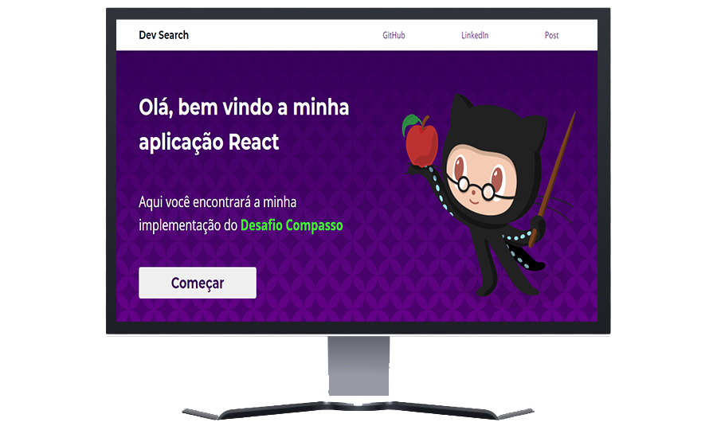

<h1 align=center>

</h1>

  <a href="#projeto">Projeto</a>&nbsp;&nbsp;&nbsp;|&nbsp;&nbsp;&nbsp;
  <a href="#tecnologias">Tecnologias</a>&nbsp;&nbsp;&nbsp;|&nbsp;&nbsp;&nbsp;
  <a target="__blank" href="https://react-desafio-compasso.vercel.app/">Deploy na Vercel</a>&nbsp;&nbsp;&nbsp;|&nbsp;&nbsp;&nbsp;
  <a href="#executar">Execução</a>&nbsp;&nbsp;&nbsp;|&nbsp;&nbsp;&nbsp;
  <a href="#env">Variável Ambiente</a>

 

<h1 align=center>
 Tela principal 💜
</h1>

  

<h2 align=center>Responsividade no Smartphone :iphone: </h2>

  

<h2 id="projeto">
💻 Projeto
</h2>

O desafio compasso é um job interview baseado em programação que utiliza a API pública do GitHub. Nessa API, é possível fazer pesquisas sobre algum usuário do GitHub, e obter diversas informações como os repositórios dele, seus favoritos, onde mora etc. Com endpoints como user, starred e repos, temos dados diferentes em cada requisição, o React entra nessa parte, criando interfaces para cada endpoint, com boa performace e rotas customizadas com o React Router DOM.

🥇 Para conferir os detalhes do desafio, clique aqui : [Desafio Compasso](https://github.com/recrutamento-compasso/api-github-interview)

 
 

<h2 id="tecnologias">
🚀 Tecnologias
</h2>

Esse projeto foi desenvolvido com a biblioteca:
- [React.js](https://pt-br.reactjs.org/)

Linguagens de marcação, estilo e programação:
 
<ul>
<li>HTML</li>
<li>CSS</li>
<li>JavaScript</li>
</ul>

 
 

<h2 id="executar">
🔴 Execução
</h2>

## Nesse link: [implementação do desafio compasso](https://react-desafio-compasso.vercel.app/)

### Scripts para clone, instalação e execução da aplicação

##### Você precisará de um terminal git, se estiver no Windows instale o [bash](https://git-scm.com/downloads)
##### 🌟 Para Linux ou MAC : [Linux](https://git-scm.com/book/pt-br/v2/Come%C3%A7ando-Instalando-o-Git) / [Mac](https://www.atlassian.com/br/git/tutorials/install-git)

### Para acompanhar, editar ou ver o andamento do projeto -
### `git clone https://github.com/lazarok09/react-desafio-compasso.git`

#### `yarn add node`
#### ou
#### `npm install node`

##### em seguida

#### `yarn dev`
##### ou
#### `npm start`

A aplicação vai abrir em :
[http://localhost:3000](http://localhost:3000)

⚠️ Esse projeto utiliza variável ambiente com token na forma final, então teremos partes comentadas no código nos componentes  User,  Starred e Repos. Mas deixei um .env_sample para você entender como foi salvo um token em forma de variável ambiente. Por questões de segurança, não posso deixar o token nessa aplicação, mas fique a vontade para colocar um no seu e testar. PS: a aplicação com deploy na Vercel têm a autenticação e realiza até 5000 requisições por hora 🥰.

💬 Para mais informações acesse [Autenticação básica](https://docs.github.com/pt/rest/overview/other-authentication-methods#basic-authentication)

## :pencil2: Autor
Lazaro Souza :runner:  
Entusiasta na arte de aprender algo do zero 
Cursando Superior de Tecnologia em Análise e Desenvolvimento de Sistemas :books: (2020-2022) 

https://www.linkedin.com/in/lazarok09
### Aprenda a usar o [markdown](https://docs.pipz.com/central-de-ajuda/learning-center/guia-basico-de-markdown#open) no seu GitHub
#### Use [emojis](https://github.com/ikatyang/emoji-cheat-sheet) no seu readme :P

< / :heart: >

